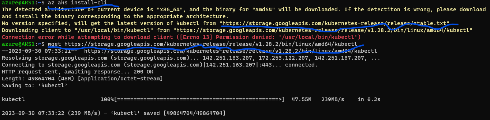
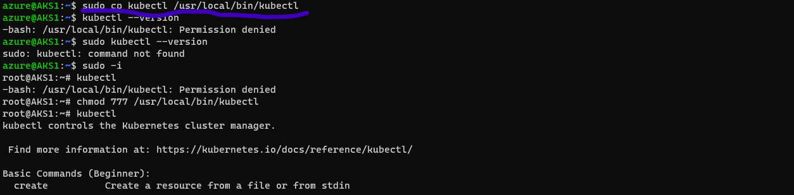
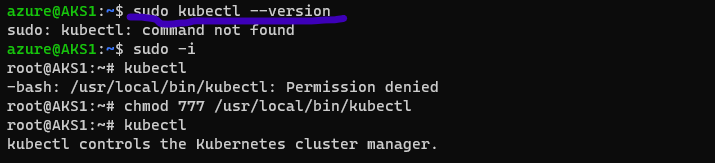
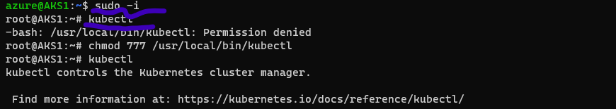
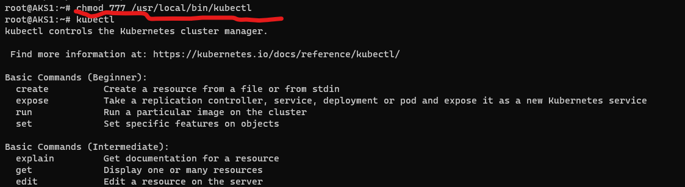
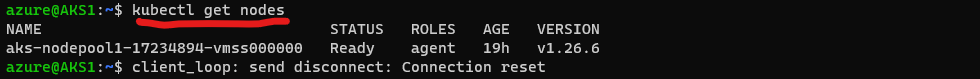

#### AKS-Installations in Azure:
### AKS Step-by-step installation instructions
* login into the azure portal
* create one VM like ubuntu for aks installations 
* login into the VM

#### Install Azure CLI
```
curl -sL https://aka.ms/InstallAzureCLIDeb | sudo bash
```

* after that we have to apply below command
```
sudo apt-get update
```
```
az login
```

in this will genrate the link and code, 
above the link copye paste in web will get the new page after it will aske code, after that az login is successed
```
az group create --name myResourceGroup --location eastus
```

```
az aks create -g myResourceGroup -n myAKSCluster --enable-managed-identity --node-count 1 --enable-addons monitoring --generate-ssh-keys
```


Install kubectl locally using the az aks install-cli command.
```
az aks install-cli
```


 if you got above error please follow below commands
```
  wget https://storage.googleapis.com/kubernetes-release/release/v1.28.2/bin/linux/amd64/kubectl
```
```
sudo cp kubectl /usr/local/bin/kubectl
```

```
kubectl --version
```

```
sudo -i
```

```
chmod 777 /usr/local/bin/kubectl
```

```
kubectl get nodes
```

